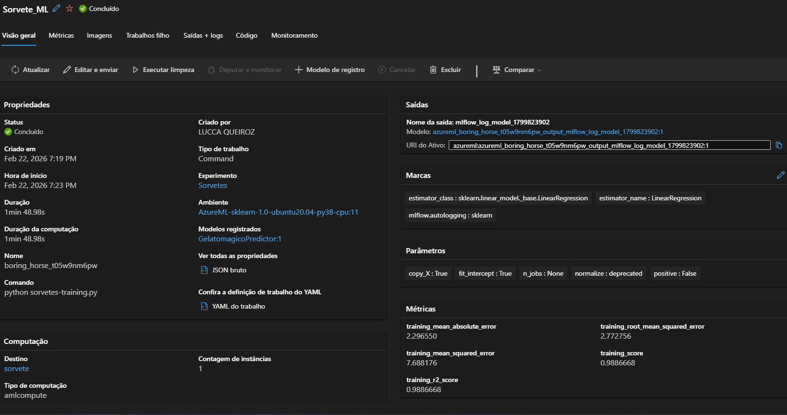
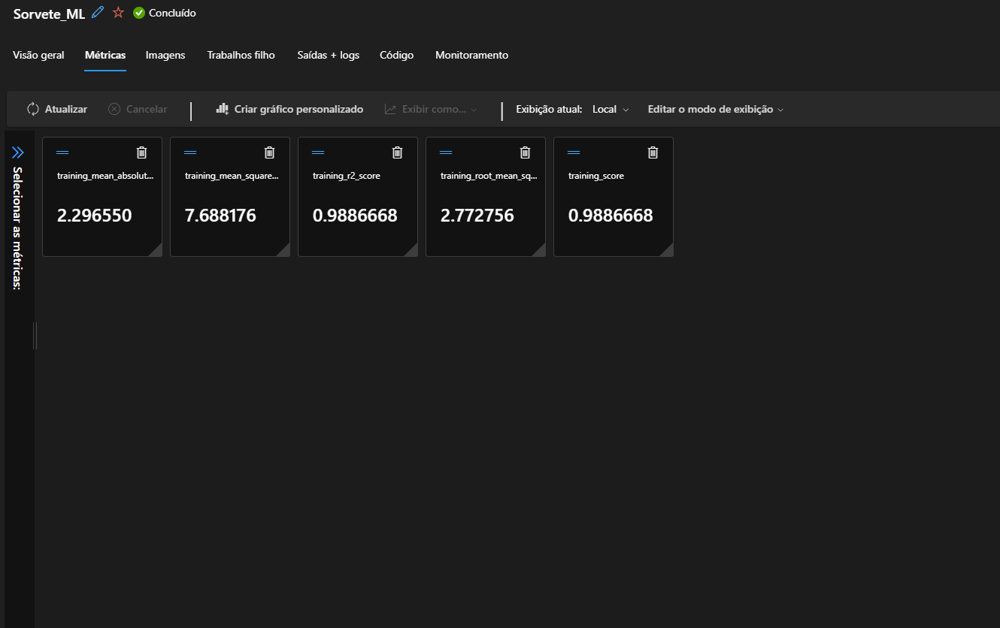
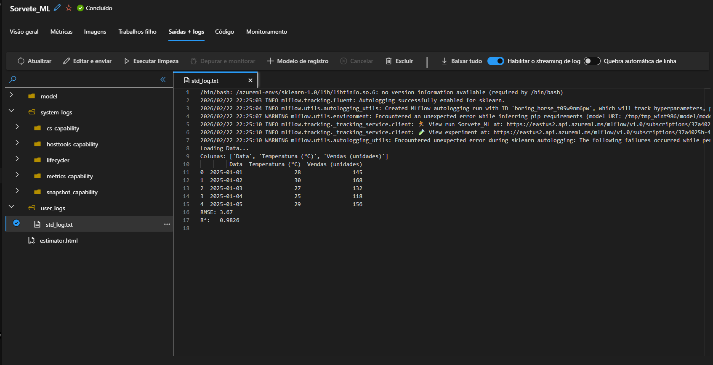

# 🍦 Gelato Mágico — Previsão de Vendas com Machine Learning

Projeto desenvolvido como parte do desafio da [DIO](https://www.dio.me/) para prever vendas de sorvete com base na temperatura do dia, utilizando Machine Learning e Azure ML.

---

## 📋 Descrição do Projeto

A sorveteria **Gelato Mágico** utiliza um modelo preditivo para antecipar a demanda diária de sorvetes com base na temperatura ambiente, otimizando a produção e reduzindo desperdícios.

---

## 🎯 Objetivo

- Treinar um modelo de regressão linear para prever vendas por temperatura
- Registrar e gerenciar experimentos com **MLflow**
- Executar o treinamento em cloud com **Azure Machine Learning**
- Criar um pipeline reprodutível e estruturado

---

## 🗂️ Estrutura do Projeto

```
gelato-magico-ml/
├── inputs/
│   └── descricao_projeto.txt
├── src/
│   ├── sorvetes-training.py
│   └── Vendas de Sorvete.csv
├── prints/
│   ├── azure-job-overview.png
│   ├── azure-logs.png
│   └── azure-metricas.png
├── sorvete.ipynb
├── requirements.txt
├── .gitignore
└── README.md
```

---

## 📊 Dataset

| Coluna | Descrição |
|---|---|
| `Temperatura (°C)` | Temperatura do dia |
| `Vendas (unidades)` | Quantidade de sorvetes vendidos |

---

## ⚙️ Tecnologias Utilizadas

- Python 3.14
- Scikit-learn (LinearRegression)
- MLflow (autolog)
- Azure Machine Learning SDK v2
- Pandas / NumPy

---

## 🚀 Como Executar

### Pré-requisitos
```bash
pip install azure-ai-ml azure-identity scikit-learn pandas numpy mlflow
az login
```

### Rodar o treinamento no Azure ML
```python
from azure.ai.ml import command, MLClient
from azure.identity import DefaultAzureCredential

ml_client = MLClient.from_config(DefaultAzureCredential())

job = command(
    code="./src",
    command="python sorvetes-training.py",
    environment="AzureML-sklearn-1.0-ubuntu20.04-py38-cpu:11",
    compute="sorvete",
    experiment_name="Sorvetes"
)
returned_job = ml_client.create_or_update(job)
print(returned_job.studio_url)
```

---

## 📈 Resultados

| Métrica | Valor |
|---|---|
| R² Score | **0.9887** |
| RMSE | 2.77 unidades |
| MAE | 2.30 unidades |

> O modelo explica **98,87%** da variação nas vendas com base na temperatura.

---

## 🖼️ Prints do Azure ML

### Job Concluído


### Métricas Registradas pelo MLflow


### Logs de Execução


---

## 💡 Insights

- A temperatura tem **forte correlação linear** com as vendas de sorvete
- O `mlflow.autolog()` registrou automaticamente todos os parâmetros e métricas
- Com previsões diárias, é possível reduzir desperdício ajustando a produção conforme a previsão do tempo
- Possíveis melhorias: adicionar features como dia da semana, feriados e umidade

---

## 👨‍💻 Autor

**Lucca Queiroz**  
[](www.linkedin.com/in/lucca-queiroz)
